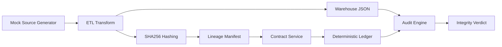
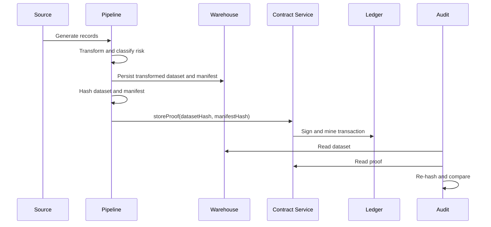

# Blockchain Data Pipeline

Offline proof of concept for ETL integrity verification with a deterministic mock blockchain, Solidity source artifact generation, warehouse audit validation, and tamper detection. The implementation is dependency-light and runs with the Python 3.12 standard library already present in this environment.

Step-by-step demo guide: [DEMO_STEP_BY_STEP.md](/home/sonnn38/Documents/BDS-projects/codex-project/blockchain-data-pipeline/DEMO_STEP_BY_STEP.md)

## Solution Summary

The system generates mock source transactions, transforms them into a warehouse dataset, computes canonical SHA256 digests for both the dataset and lineage metadata, and commits those proofs to a deterministic local ledger through a signed transaction service. The audit engine independently recalculates the warehouse hash and compares it with the stored proof. A tamper simulation then modifies the warehouse after the commit and shows that the recalculated digest no longer matches the blockchain record.

## Project Structure

```text
blockchain-data-pipeline/
├── docker-compose.yml
├── .env.example
├── requirements.txt
├── README.md
├── contracts/
├── infrastructure/
├── pipeline/
├── blockchain/
├── audit/
├── tests/
└── airflow/dags/
```

## Local Execution

```bash
cd blockchain-data-pipeline
cp .env.example .env
python3 contracts/deploy.py
python3 pipeline/etl_pipeline.py
python3 ui/server.py
python3 -m unittest discover -s tests -p 'test_*.py'
python3 tests/simulate_tamper_attack.py
```

UI dashboard:

- Start with `python3 ui/server.py`
- Open `http://127.0.0.1:8000`
- Use the buttons to deploy the contract, run the pipeline, store proof, audit, and simulate tampering

## Docker Deployment

```bash
cd blockchain-data-pipeline
cp .env.example .env
docker compose up --build
```

The compose file mounts the project into a `python:3.12-slim` container and runs the pipeline entrypoint. In this workspace, Docker validation could not be executed because `docker` is not installed on the host as of May 29, 2026.

## Smart Contract Deployment

`contracts/deploy.py` performs the following steps:

1. Loads settings and initializes the deterministic ledger.
2. Reads [`contracts/DataPipelineGovernance.sol`](/home/sonnn38/Documents/BDS-projects/codex-project/blockchain-data-pipeline/contracts/DataPipelineGovernance.sol).
3. Produces [`contracts/artifacts/DataPipelineGovernance.json`](/home/sonnn38/Documents/BDS-projects/codex-project/blockchain-data-pipeline/contracts/artifacts/DataPipelineGovernance.json).
4. Generates a deterministic contract address and writes deployment state to [`state/deployment.json`](/home/sonnn38/Documents/BDS-projects/codex-project/blockchain-data-pipeline/state/deployment.json).

## Test Commands

```bash
python3 -m compileall .
python3 -m unittest discover -s tests -p 'test_*.py'
python3 tests/simulate_tamper_attack.py
```

## Validation Evidence

Successful deployment output:

```text
0x2add3fe1437fc3af695488d8beb520ce85e6b695
```

Successful pipeline output captured on May 29, 2026:

```json
{
  "contract_address": "0x2add3fe1437fc3af695488d8beb520ce85e6b695",
  "transaction_hash": "7014ac62fe49908b4accbff9e703e1b0bb537a310c7943168758d3153055145c",
  "dataset_hash": "fea7065a133eb17e94c916250462fe2ce06f04e36327a149063ca97828eb48b8",
  "manifest_hash": "0a3db80110198f27ec1175d8b96daa99e2f7312296de91759fa413a59e4c732f",
  "audit_message": "Hash Match - Data Integrity Verified",
  "warehouse_path": "warehouse/warehouse.json"
}
```

Successful test run:

```text
Ran 3 tests in 0.008s
OK
```

Tamper detection output captured on May 29, 2026:

```text
Hash Mismatch - Data Tampering Detected
```

## Architecture Diagram



## Data Flow Diagram



## Threat Model Summary

- Unauthorized post-load warehouse modification changes business values after the proof has been committed.
- Replay of stale manifests can create false lineage unless each run is versioned and timestamped.
- Signing key compromise would let an attacker publish fraudulent proofs even though the ledger itself remains append-only.
- A real deployment still needs role-based access control, key custody, and independent node verification to reduce insider risk.

## Thesis-Ready Integrity and Traceability Explanation

Blockchain strengthens data integrity by creating an append-only evidence layer that is independent from the operational warehouse. In this proof of concept, the transformed dataset is normalized and hashed using SHA256, producing a deterministic fingerprint that changes whenever any record value changes. The pipeline also creates a lineage manifest describing the dataset, run identifier, record count, source system, and target warehouse location. A second digest is calculated from that manifest. Both digests are then committed through a signed blockchain transaction and stored in contract state.

This design gives traceability because every dataset version is bound to a specific pipeline execution and ledger transaction. Auditors can read the warehouse contents, recalculate the digest, retrieve the on-chain proof, and verify whether both values still match. If an unauthorized modification occurs after the original commit, even a one-character change will produce a different hash and the audit engine will report a mismatch. In a production implementation on Ethereum or another smart-contract platform, the same pattern provides tamper-evident lineage, strong non-repudiation for proof publication, and a verifiable chain of custody for analytical datasets.
