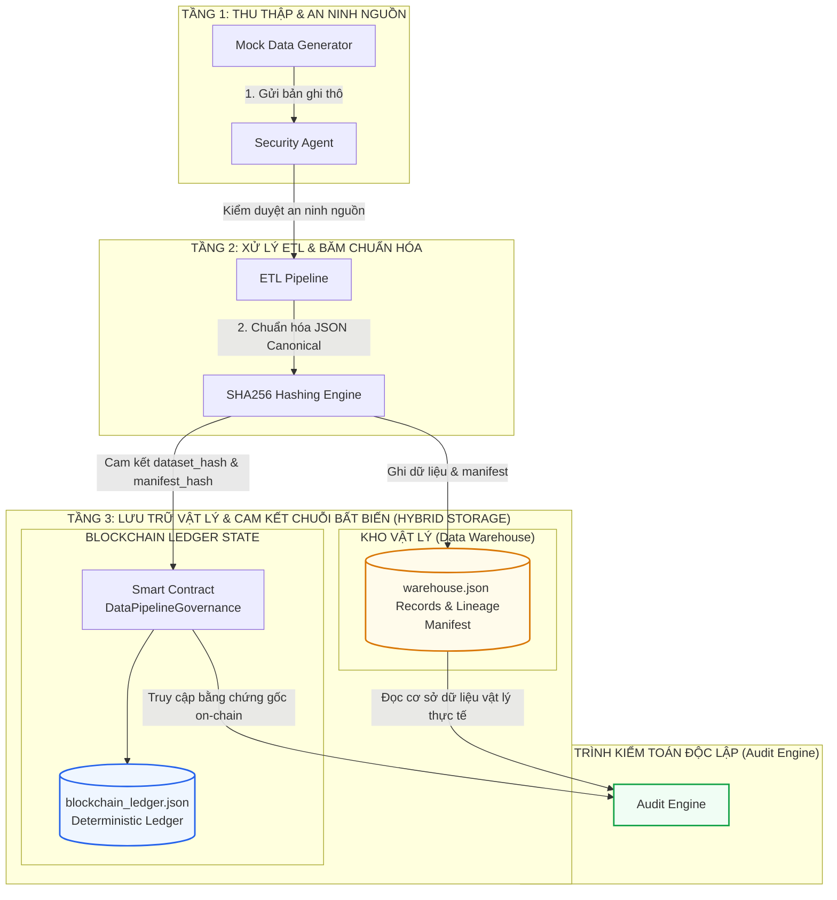
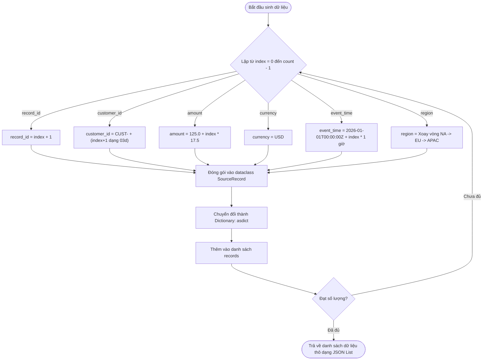
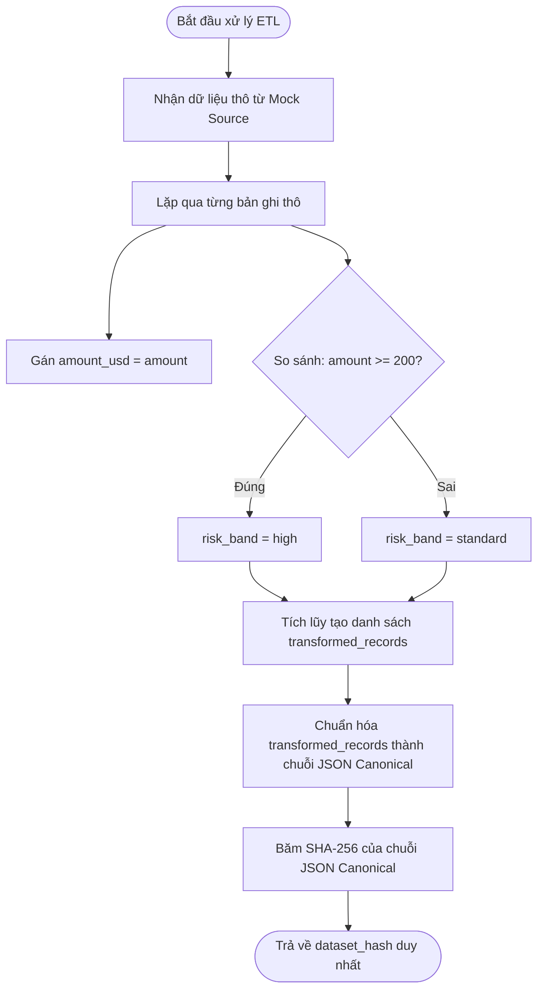
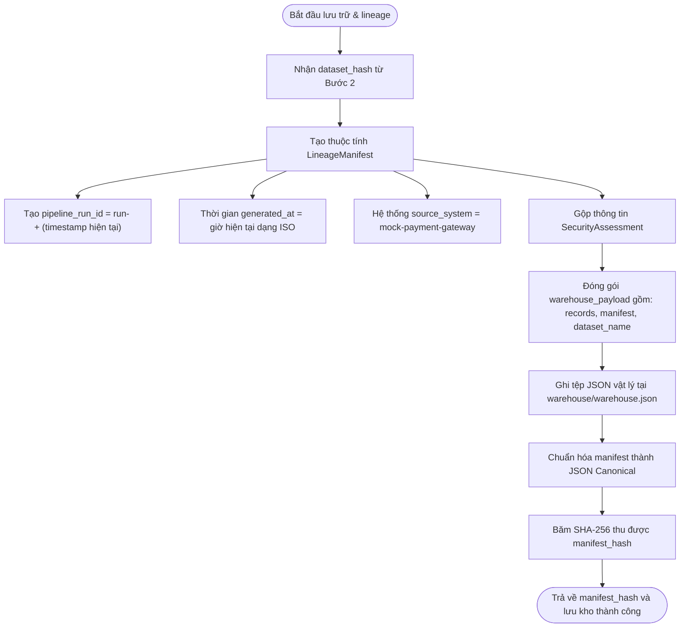
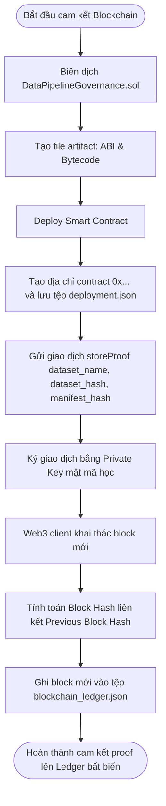
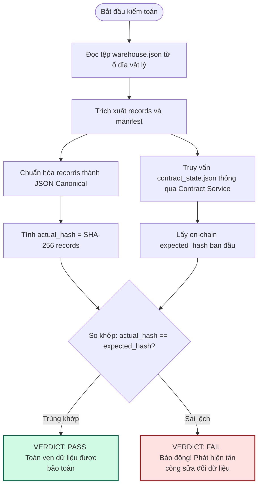
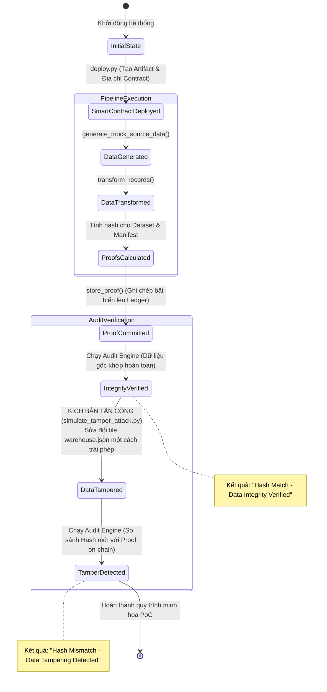

# QUY TRÌNH HOẠT ĐỘNG HỆ THỐNG BLOCKCHAIN DATA PIPELINE
*(Tài liệu báo cáo khoa học và sơ đồ luồng dữ liệu)*

Tài liệu này tổng hợp toàn bộ cấu trúc kiến trúc, luồng đi của dữ liệu (Data Flow) và quy trình kiểm toán toàn vẹn dữ liệu kết hợp sổ cái Blockchain giả lập cho dự án **blockchain-data-pipeline**. Các sơ đồ dưới đây sử dụng định dạng **Mermaid Diagram** được hỗ trợ hiển thị trực quan trực tiếp trên các trình duyệt Markdown hoặc các công cụ hỗ trợ (như VS Code, GitHub).

---

## 1. Sơ Đồ Kiến Trúc Hệ Thống (System Architecture Flowchart)

Sơ đồ kiến trúc phân tầng dưới đây cung cấp một cái nhìn tổng quan (bird's-eye view) về các tầng thành phần trong hệ thống, cách chúng tương tác và dòng chảy của dữ liệu từ nguồn thu thập đến lớp lưu trữ vật lý, sổ cái Blockchain và công cụ kiểm toán độc lập:



---

## 2. Giải Thích Các Bước Chi Tiết Trong Quy Trình

Dưới đây là phần phân tích kỹ thuật chuyên sâu và các sơ đồ mô tả thuật toán chi tiết cho từng bước vận hành bên trong hệ thống:

### Bước 1: Thu thập và Đánh giá An ninh Nguồn (Mock Source & Security Assessment)
* **Thành phần**: `pipeline/mock_sources.py`, `pipeline/security_agent.py`
* **Mô tả**: Dữ liệu thô giả lập được tạo ra tự động. Trước khi đưa vào xử lý ETL, `SecurityAgent` sẽ quét tìm các bất thường chất lượng dữ liệu (ví dụ: giao dịch có số tiền âm hoặc bằng không). Trạng thái này (`pass` hoặc `review`) sẽ được đóng gói lại thành `SecurityAssessment`.

#### Quy Trình Sinh Dữ Liệu Thô (Raw Data Generation Flow)

Dữ liệu đầu vào của hệ thống được giả lập tự động nhằm kiểm thử đường ống ETL và cơ chế ký số. Tiến trình chạy sẽ lặp qua số lượng bản ghi được yêu cầu (`record_count`) và tính toán động các giá trị dựa trên chỉ mục (loop index):



#### Mẫu Dữ Liệu Thô Đầu Vào (Sample Raw Records)
Dưới đây là cấu trúc mẫu của 3 bản ghi đầu tiên được tạo ra bởi hàm `generate_mock_source_data(3)`:

```json
[
  {
    "record_id": 1,
    "customer_id": "CUST-001",
    "amount": 125.0,
    "currency": "USD",
    "event_time": "2026-01-01T00:00:00+00:00",
    "region": "NA"
  },
  {
    "record_id": 2,
    "customer_id": "CUST-002",
    "amount": 142.5,
    "currency": "USD",
    "event_time": "2026-01-01T01:00:00+00:00",
    "region": "EU"
  },
  {
    "record_id": 3,
    "customer_id": "CUST-003",
    "amount": 160.0,
    "currency": "USD",
    "event_time": "2026-01-01T02:00:00+00:00",
    "region": "APAC"
  }
]
```

---

### Bước 2: Chuyển đổi ETL & Chuẩn Hóa Dữ Liệu (ETL & Canonical Hashing)
* **Thành phần**: `pipeline/etl_pipeline.py`, `pipeline/hashing.py`
* **Mô tả**: Dữ liệu được tính toán thêm cột `amount_usd` và xếp loại `risk_band` (High/Standard). Nhằm đảm bảo dữ liệu băm không bị ảnh hưởng bởi định dạng khoảng trắng hay thứ tự khóa trong tệp JSON, hệ thống sử dụng cơ chế **Canonical Serialization** trước khi đưa qua thuật toán băm SHA256 thu về `dataset_hash` duy nhất.

#### Sơ Đồ Quy Trình ETL & Chuẩn Hóa Băm (ETL & Canonical Hashing Flow)



---

### Bước 3: Tạo Lineage Manifest & Lưu Dữ Liệu Vào Warehouse
* **Thành phần**: `pipeline/lineage.py`, `pipeline/warehouse_writer.py`
* **Mô tả**: Siêu dữ liệu truy vết nguồn gốc (gồm `dataset_hash`, thời gian chạy, số lượng bản ghi, ID tiến trình chạy pipeline và thông tin đánh giá an ninh) được đóng gói thành `LineageManifest`. Bản kê này sau đó được băm ra `manifest_hash`. Toàn bộ dữ liệu thực tế và manifest được ghi xuống tệp `warehouse/warehouse.json`.

#### Sơ Đồ Lưu Warehouse & Tạo Manifest Hash Flow



---

### Bước 4: Cam Kết Bằng Chứng Bất Biến Lên Blockchain
* **Thành phần**: `blockchain/`, `contracts/DataPipelineGovernance.sol`
* **Mô tả**: Hai chữ ký số (`dataset_hash` và `manifest_hash`) được gửi lên smart contract giả lập thông qua hàm `storeProof`. Hệ thống giả lập các khối (blocks) tuần tự của blockchain bằng sổ cái `state/blockchain_ledger.json` được ký bằng khóa riêng mật mã học.

#### Sơ Đồ Khai Thác Khối & Cam Kết Proof Flow



---

### Bước 5: Kiểm Toán Độc Lập Phát Hiện Thay Đổi
* **Thành phần**: `audit/audit_engine.py`
* **Mô tả**: Để xác thực tính toàn vẹn, Audit Engine đọc lại tệp `warehouse/warehouse.json`, tính toán lại hash và truy tìm bằng chứng gốc đã lưu trên blockchain thông qua hàm `getProof`. Nếu bất kỳ ai chỉnh sửa dù chỉ một ký tự hoặc số tiền của bất kỳ giao dịch nào trong warehouse, kết quả băm thực tế sẽ thay đổi, hệ thống sẽ ngay lập tức so khớp lệch và báo động hành vi phá hoại dữ liệu.

#### Sơ Đồ Quy Trình Kiểm Toán & Phát Hiện Tấn Công Flow



---

## 3. Luồng Trình Tự Tương Tác Dữ Liệu (Data Flow Sequence Diagram)

Sơ đồ trình tự dưới đây biểu diễn dòng thời gian tương tác giữa các đối tượng lập trình (Python classes) khi chạy đường ống ETL hoàn chỉnh cho đến khi thực hiện quy trình kiểm toán độc lập:

```mermaid
sequenceDiagram
    autonumber
    participant Src as Mock Sources
    participant Sec as Security Agent
    participant ETL as ETL Pipeline
    participant WH as Warehouse
    participant CS as Contract Service
    participant Web3 as Web3 Ledger Client
    participant Audit as Audit Engine

    Note over Src, ETL: QUY TRÌNH CHẠY PIPELINE ETL & GHI PROOF
    Src->>ETL: generate_mock_source_data(count)
    ETL->>Sec: inspect_records(raw_records)
    Sec-->>ETL: SecurityAssessment (pass/review)
    ETL->>ETL: transform_records() [Thêm risk_band & amount_usd]
    ETL->>ETL: sha256_digest(transformed_records) -> dataset_hash
    ETL->>ETL: build_lineage_manifest()
    ETL->>WH: write_warehouse(warehouse.json, payload)
    ETL->>ETL: sha256_digest(manifest) -> manifest_hash

    Note over ETL, Web3: ĐỒNG BỘ HÓA LÊN BLOCKCHAIN
    ETL->>CS: store_proof(dataset_name, dataset_hash, manifest_hash)
    CS->>Web3: mine_transaction(tx_payload)
    Note over Web3: Tính toán Block Hash mới dạng:<br/>sha256(prev_hash : tx_hash : block_no)
    Web3-->>CS: Transaction Receipt (Mined)
    CS-->>ETL: Receipt & Proof Committed

    Note over WH, Audit: QUY TRÌNH KIỂM TOÁN TỰ ĐỘNG
    Audit->>WH: read_warehouse(warehouse.json)
    WH-->>Audit: records & manifest
    Audit->>Audit: sha256_digest(records) -> actual_hash
    Audit->>CS: get_proof(dataset_name)
    CS-->>Audit: Stored Proof (expected_hash, manifest_hash)
    Audit->>Audit: So sánh (actual_hash == expected_hash)
    Audit-->>ETL: VerificationResult (pass/fail)
```



---

## 4. Vòng Đời Trạng Thái & Phát Hiện Sửa Đổi Trái Phép (Lifecycle & Tamper Detection)

Sơ đồ trạng thái dưới đây mô tả quy trình giả lập tấn công sửa đổi cơ sở dữ liệu vật lý (tập tin `warehouse.json`) để chứng minh cơ chế phát hiện sai lệch thực tế của hệ thống:


