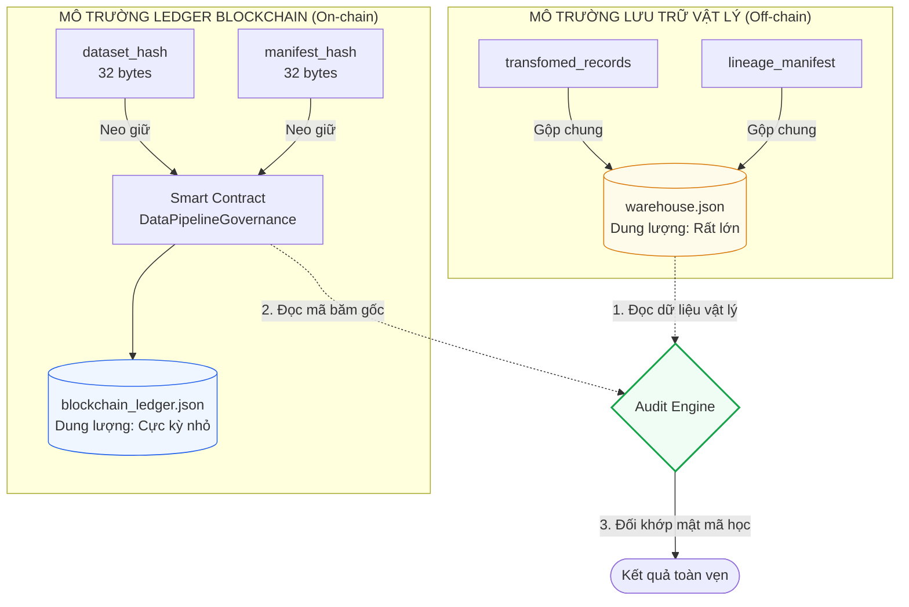
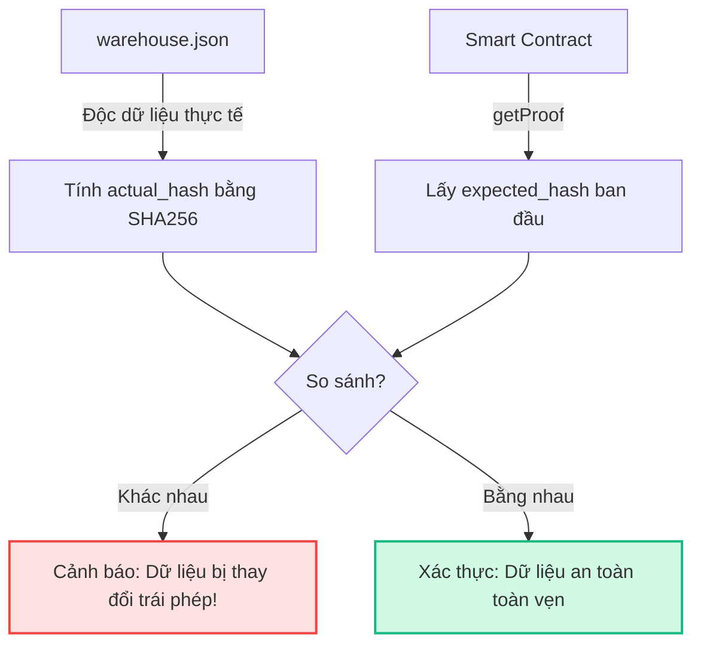

# TÀI LIỆU HỎI & ĐÁP (Q&A): BẢO VỆ ĐỀ TÀI NGHIÊN CỨU KHOA HỌC
*(Cẩm nang chuẩn bị phản biện dành cho tác giả)*

Tài liệu này tổng hợp toàn bộ các câu hỏi phản biện chuyên sâu từ Hội đồng khoa học (Giáo viên phản biện, Chuyên gia an toàn thông tin) và cung cấp các câu trả lời chặt chẽ, khoa học, bám sát kiến trúc thực tế của hệ thống **blockchain-data-pipeline**.

---

## 1. Bản Đồ Phân Tách Biên Giới On-chain & Off-chain

Để tối ưu hóa chi phí lưu trữ và đảm bảo hiệu năng của hệ thống, ranh giới lưu trữ giữa môi trường On-chain và Off-chain được thiết kế chặt chẽ như sau:



---

## 2. Chi Tiết Câu Hỏi & Câu Trả Lời Phản Biện

### Câu hỏi 1: Blockchain lưu trữ những gì?
*   **Câu trả lời**:
    Blockchain **KHÔNG** lưu trữ toàn bộ dữ liệu giao dịch thực tế vì kích thước dữ liệu lớn sẽ làm nghẽn mạng lưới chuỗi khối và gây tốn kém chi phí lưu trữ on-chain vô cùng lớn.
    Thay vào đó, Blockchain chỉ lưu trữ **Bằng chứng mật mã học rút gọn (Cryptographic Proofs)** với kích thước cố định vô cùng nhỏ, bao gồm:
    1.  `dataset_hash` (Mã băm SHA-256 của tập dữ liệu giao dịch đã chuẩn hóa - 32 bytes).
    2.  `manifest_hash` (Mã băm SHA-256 của siêu dữ liệu nguồn gốc dữ liệu - 32 bytes).
    3.  `dataset_name` (Định danh chuỗi dữ liệu, ví dụ: `"daily_customer_payments"`).
    4.  Siêu dữ liệu giao dịch: Block number, transaction hash, địa chỉ ví người ký.

---

### Câu hỏi 2: On-chain và Off-chain phân tách như thế nào?
*   **Câu trả lời**:
    *   **Phần Off-chain**: Toàn bộ dữ liệu thực tế đã biến đổi (`Records`) và tệp siêu dữ liệu truy vết nguồn gốc đầy đủ (`Manifest` chứa thời gian chạy, số lượng dòng, định danh chạy) được ghi vào tệp cơ sở dữ liệu vật lý `warehouse.json` đặt tại máy chủ lưu trữ (Data Warehouse).
    *   **Phần On-chain**: Chỉ các dấu vân tay số thu gọn đại diện cho trạng thái của dữ liệu (`dataset_hash` và `manifest_hash`) mới được gửi lên và neo giữ bất biến trên Blockchain.
    *   **Mối liên kết**: Sự phân tách này đảm bảo tối ưu hóa chi phí lưu trữ chuỗi đồng thời bảo toàn tính riêng tư của dữ liệu (Data Privacy) vì dữ liệu thô nhạy cảm không bao giờ bị lộ lọt công khai trên Blockchain.

---

### Câu hỏi 3: Nếu dữ liệu trong kho vật lý (Warehouse) bị sửa đổi lén hoặc sửa metadata thì phát hiện bằng cách nào?
*   **Câu trả lời**:
    Khi kẻ tấn công xâm nhập máy chủ vật lý và cố tình sửa đổi bất kỳ bản ghi giao dịch nào hoặc can thiệp sửa tệp `manifest` (ví dụ: thay đổi số lượng bản ghi thực tế, sửa thời gian chạy để ngụy tạo nguồn gốc):
    1.  Công cụ kiểm toán `Audit Engine` thực hiện đọc dữ liệu thực tế tại kho vật lý.
    2.  Tính toán lại mã băm của tập dữ liệu thực tế hiện tại ($H_{\text{actual}}$) bằng cơ chế chuẩn hóa băm SHA-256.
    3.  Truy vấn bằng chứng băm gốc ban đầu ($H_{\text{expected}}$) từ Smart Contract bằng hàm `getProof`.
    4.  Do tính chất **kháng va chạm (collision resistance)** của thuật toán SHA-256, chỉ cần thay đổi 1 ký tự hay khoảng trắng, mã băm thực tế sẽ khác xa mã băm gốc ban đầu:
        $$H_{\text{actual}} \neq H_{\text{expected}}$$
    5.  Hệ thống kiểm toán lập tức từ chối xác thực dữ liệu và phát tín hiệu cảnh báo xâm nhập.



---

### Câu hỏi 4: Nếu Airflow lineage (truy vết nguồn gốc dữ liệu) bị hacker sửa thì Blockchain chứng minh ra sao?
*   **Câu trả lời**:
    *   Trong kiến trúc đường ống, ngay tại thời điểm pipeline chạy thành công, Airflow tự động ghi nhận lineage manifest và cam kết mã băm của manifest này lên Blockchain **ngay lập tức trong cùng một phiên**.
    *   Mặc dù hacker có thể xâm nhập cơ sở dữ liệu của Airflow hoặc sửa đổi tệp nhật ký lineage vật lý ở tầng lưu trữ để làm sai lệch đường đi của dữ liệu, nhưng **dấu vết băm manifest đã được đóng dấu thời gian (Block Timestamp) bất biến** trên sổ cái Blockchain.
    *   Hacker hoàn toàn không có khả năng sửa đổi dữ liệu quá khứ trên sổ cái phân tán. Khi Trình kiểm toán đối chiếu mã băm manifest vật lý hiện tại với mã băm manifest lưu trữ trên Blockchain, hệ thống sẽ phát hiện ra sự sai lệch ngay lập tức. Blockchain đóng vai trò làm **Nguồn sự thật duy nhất (Single Source of Truth)** không thể chối cãi.

---

### Câu hỏi 5: Tại sao phải sử dụng Blockchain thay vì một giải pháp PostgreSQL ghi nhật ký chỉ cho phép thêm (Append-only Log)?
*   **Câu trả lời**:
    *   **Giới hạn của PostgreSQL Append-only**: Dù được cấu hình chỉ cho phép chèn thêm dữ liệu (append-only), cơ sở dữ liệu PostgreSQL vẫn là hệ thống **tập trung (Centralized)**. Quản trị viên hệ thống (DBA) có quyền root hoặc tài khoản quản trị tối cao hoàn toàn có thể vô hiệu hóa cơ chế ghi log, chỉnh sửa dữ liệu trực tiếp trên tệp cứng vật lý ở ổ đĩa, hoặc sửa đổi chính tệp log mà không để lại bất kỳ dấu vết nào. PostgreSQL luôn có **Điểm lỗi duy nhất (Single Point of Failure)**.
    *   **Sức mạnh của Blockchain**: Là hệ thống sổ cái **phi tập trung (Decentralized)** hoạt động dựa trên cơ chế đồng thuận mật mã học. Không có bất kỳ cá nhân hay quản trị viên hệ thống nào sở hữu đặc quyền tối cao để đơn phương sửa đổi dữ liệu đã ghi nhận trên chuỗi khối, kể cả khi họ nắm giữ quyền kiểm soát máy chủ vật lý. Dữ liệu một khi đã ghi là **bất biến vĩnh viễn (immutability)** nhờ sự bảo vệ phi tập trung của toàn bộ mạng lưới.

---

### Câu hỏi 6: Chi phí ghi nhận bằng chứng lên Blockchain thực tế là bao nhiêu?
*   **Câu trả lời**:
    Chi phí này cực kỳ nhỏ nhờ thiết kế **Băm lai (Hybrid Hashing Architecture)**:
    *   Hệ thống chỉ lưu trữ đúng 2 mã băm dấu vân tay số (mỗi mã băm SHA-256 chỉ có kích thước cố định là **32 bytes**).
    *   Nếu triển khai trên các mạng lưới Blockchain Layer 2 (L2) thực tế của Ethereum như Arbitrum, Optimism hay Base:
        *   Mỗi giao dịch gọi hàm `storeProof` tiêu tốn khoảng **40.000 đến 50.000 Gas**.
        *   Tại mức phí gas L2 trung bình hiện tại, chi phí thực tế chỉ dao động từ **$0.0008 USD đến $0.003 USD** cho mỗi lần chạy pipeline hàng ngày. Đây là mức chi phí vô cùng tối ưu và hoàn toàn khả thi để ứng dụng thực tế trong doanh nghiệp lớn.

---

### Câu hỏi 7: Độ trễ (End-to-End Latency) của hệ thống tăng thêm bao nhiêu khi tích hợp Blockchain?
*   **Câu trả lời**:
    *   Quá trình tính toán băm SHA-256 và chuẩn hóa dữ liệu off-chain diễn ra cực kỳ nhanh (dưới **5 - 10 mili-giây** cho hàng triệu dòng bản ghi).
    *   Độ trễ tăng thêm chủ yếu nằm ở thời gian chờ mạng lưới Blockchain xác nhận và đóng gói giao dịch vào khối mới (Block Confirmation Time):
        *   Trên mạng Ethereum Layer 2: Chỉ mất khoảng **0.25 giây đến 2 giây** để hoàn thành giao dịch bất biến.
        *   Trên sổ cái Blockchain giả lập của dự án: Việc đóng khối diễn ra gần như tức thời (dưới **10 mili-giây**).
    *   Vì tác vụ chạy dữ liệu và kiểm toán thường được thiết kế chạy theo lô (Batch Processing) định kỳ hàng giờ hoặc hàng ngày chứ không phải luồng dữ liệu thời gian thực (Real-time Streaming), nên độ trễ vài giây này hoàn toàn **không ảnh hưởng** đến hiệu suất vận hành chung của hệ thống.

---

### Câu hỏi 8: Cơ chế xác thực mã băm (Verify Hash) hoạt động toán học như thế nào?
*   **Câu trả lời**:
    Cơ chế đối sánh mật mã học được thực hiện qua 3 bước toán học nghiêm ngặt:
    1.  **Bước 1: Tính toán băm thực tế ($H_{\text{actual}}$)**: Đọc tập dữ liệu giao dịch off-chain, chuẩn hóa bằng thuật toán Canonical JSON và băm SHA-256:
        $$H_{\text{actual}} = \text{SHA-256}(\text{Canonical}(\text{records}))$$
    2.  **Bước 2: Lấy băm gốc on-chain ($H_{\text{expected}}$)**: Thực hiện lệnh gọi không tốn gas (`eth_call` / `view function`) truy vấn trạng thái Smart Contract:
        $$H_{\text{expected}} = \text{SmartContract.getProof}(\text{dataset\_name})$$
    3.  **Bước 3: Đối sánh logic**:
        $$\text{Kết quả kiểm toán} = \begin{cases} 
        \text{PASS (Toàn vẹn dữ liệu),} & \text{nếu } H_{\text{actual}} == H_{\text{expected}} \\ 
        \text{FAIL (Cảnh báo thay đổi trái phép),} & \text{nếu } H_{\text{actual}} \neq H_{\text{expected}} 
        \end{cases}$$

---

### Câu hỏi 9: Smart Contract lưu giữ những trường thông tin gì?
*   **Câu trả lời**:
    Để tối ưu hóa chi phí lưu trữ tài nguyên trạng thái trên chuỗi khối (State Storage Efficiency), cấu trúc dữ liệu lưu trong Smart Contract Solidity (`DataPipelineGovernance.sol`) được thiết kế tối giản:
    ```solidity
    struct Proof {
        string datasetHash;  // Hash của tập dữ liệu giao dịch (SHA-256)
        string manifestHash; // Hash của tệp siêu dữ liệu nguồn gốc (SHA-256)
    }
    mapping(string => Proof) private proofs; // Bảng băm datasetName => Proof
    ```
    *   **Trường khóa (Key)**: `string datasetName` (Tên định danh chuỗi dữ liệu giao dịch).
    *   **Trường giá trị (Value)**: Cấu trúc `Proof` gồm hai thuộc tính `datasetHash` và `manifestHash`.

---

### Câu hỏi 10: Nếu một nút Blockchain (Blockchain Node) bị sập hoặc mất kết nối thì khả năng phục hồi dữ liệu ra sao?
*   **Câu trả lời**:
    *   Blockchain hoạt động theo mô hình **mạng phân tán ngang hàng (P2P Mesh Network)**. Mỗi nút (node) trong hệ thống đều lưu trữ một bản sao **hoàn chỉnh, độc lập và đồng bộ 100%** lịch sử của toàn bộ chuỗi khối (Full Ledger History).
    *   Nếu một hoặc nhiều node bị sập, bị phá hủy vật lý hoặc bị tấn công từ chối dịch vụ (DDoS):
        1.  Mạng lưới vẫn tiếp tục hoạt động liên tục nhờ các node còn lại.
        2.  Khi dựng lại một node mới để thay thế, node đó chỉ cần kết nối vào mạng lưới P2P và nó sẽ **tự động đồng bộ hóa, tải về toàn bộ lịch sử giao dịch số cái** từ các node lân cận nhờ cơ chế đồng thuận đồng nhất mật mã học.
        3.  Tuyệt đối không có bất kỳ dữ liệu chứng cứ mật mã học nào bị thất thoát hay bị thay đổi trong suốt quá trình phục hồi này.
