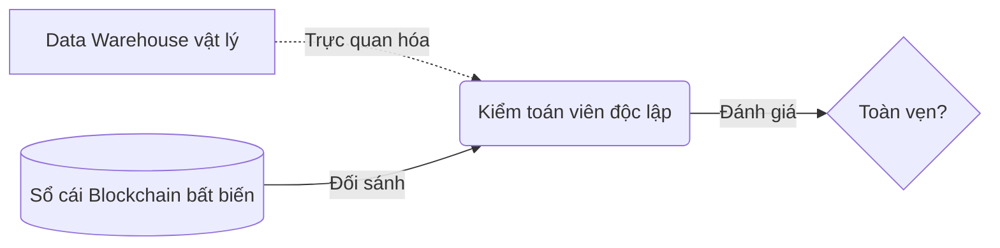
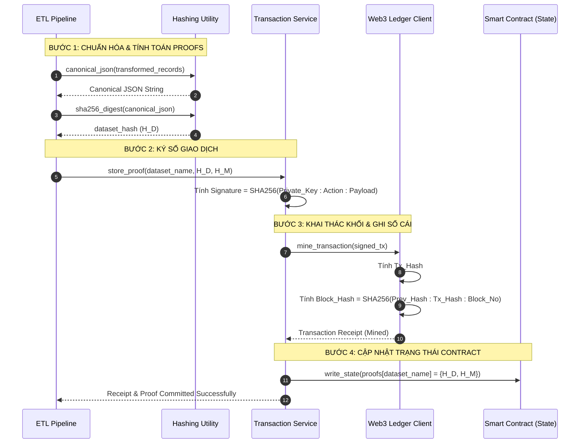
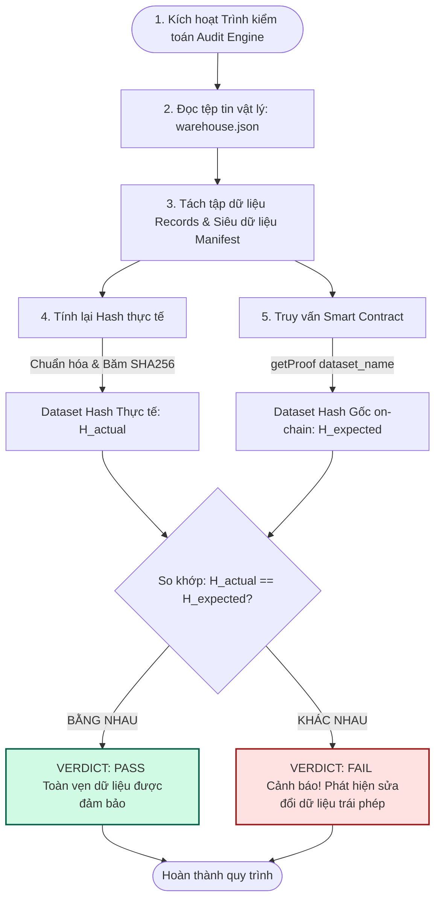

# BÁO CÁO CHUYÊN ĐỀ: KIẾN TRÚC BLOCKCHAIN & CÁC THUẬT TOÁN BẢO MẬT
*(Tài liệu thuộc đề tài Phương pháp Nghiên cứu Khoa học - An toàn Thông tin)*

Tài liệu này phân tích chi tiết cấu trúc sổ cái Blockchain giả lập (Deterministic Ledger Simulation), cơ chế ký số giao dịch và các thuật toán mật mã học đang được áp dụng trong dự án **blockchain-data-pipeline** nhằm bảo toàn tính toàn vẹn dữ liệu (Data Integrity) và phát hiện hành vi sửa đổi trái phép (Tamper Detection).

---

## 1. Tổng Quan Kiến Trúc Blockchain Trong Hệ Thống

Trong hệ thống đường ống dữ liệu (Data Pipeline), dữ liệu sau khi biến đổi (ETL) thường được lưu trữ tại kho dữ liệu vật lý (Data Warehouse) dưới dạng tệp tin thông thường (ví dụ: tệp JSON). Tuy nhiên, môi trường lưu trữ vật lý này dễ bị tấn công sửa đổi trực tiếp bởi quản trị viên hệ thống có hành vi xấu hoặc tin tặc xâm nhập.

Để giải quyết triệt để vấn đề này, hệ thống tích hợp giải pháp **On-chain Proof of Existence** (Bằng chứng tồn tại trên chuỗi). Sổ cái Blockchain đóng vai trò lưu trữ dấu vân tay số (Cryptographic Fingerprints) bất biến của dữ liệu dưới dạng các bản băm và chữ ký số.



---

## 2. Các Thuật Toán & Phương Pháp Mật Mã Học Áp Dụng

Hệ thống sử dụng các giải pháp mật mã học tiêu chuẩn để xây dựng cơ chế bảo vệ dữ liệu đa lớp từ tầng ETL đến tầng lưu trữ bất biến.

### 2.1. Chuẩn Hóa Dữ Liệu (Canonical JSON Serialization)
*   **Vấn đề**: Thuật toán băm một chiều (SHA-256) cực kỳ nhạy cảm với dữ liệu đầu vào. Chỉ cần thay đổi 1 khoảng trắng, thứ tự các khóa trong tệp JSON hoặc định dạng dòng cũng sẽ tạo ra một mã băm hoàn toàn khác (Hiệu ứng thác đổ - Avalanche Effect).
*   **Giải pháp**: Dữ liệu trước khi băm phải đi qua bộ chuẩn hóa **Canonical Serialization**.
*   **Thuật toán thực thi**:
    *   Sắp xếp tất cả các khóa (keys) của đối tượng JSON theo thứ tự bảng chữ cái (`sort_keys=True`).
    *   Loại bỏ toàn bộ khoảng trắng dư thừa xung quanh dấu hai chấm và dấu phẩy (`separators=(",", ":")`).
    *   Mã hóa chuỗi ký tự chuẩn hóa bằng định dạng **UTF-8**.
*   **Công thức thực hiện trong Python (`pipeline/hashing.py`)**:
    $$S_{\text{canonical}} = \text{Serialize}(D, \text{sort\_keys}=\text{True}, \text{separators}=(',', ':'))$$

### 2.2. Thuật Toán Băm Một Chiều (SHA-256)
*   **Vai trò**: Tạo mã nhận diện duy nhất (Hash) cho Dataset và Manifest mà không làm lộ nội dung giao dịch thực tế bên trong.
*   **Giải pháp thực thi**:
    *   **Dataset Hash ($H_D$)**: Băm toàn bộ tập dữ liệu giao dịch đã chuyển đổi.
        $$H_D = \text{SHA-256}(S_{\text{canonical\_dataset}})$$
    *   **Manifest Hash ($H_M$)**: Băm toàn bộ siêu dữ liệu truy vết nguồn gốc (lineage metadata bao gồm thời gian chạy, số bản ghi, và kết quả đánh giá an ninh nguồn).
        $$H_M = \text{SHA-256}(S_{\text{canonical\_manifest}})$$

### 2.3. Cơ Chế Chữ Ký Số Giao Dịch (Digital Signature Simulation)
*   **Mục tiêu**: Đảm bảo tính xác thực nguồn gốc (Authenticity) và tính chống chối bỏ (Non-repudiation). Chỉ tiến trình chạy Pipeline được cấp khóa bí mật (Private Key) hợp lệ mới có quyền gửi bằng chứng lên Smart Contract.
*   **Thuật toán ký số (`blockchain/transaction_service.py`)**:
    Mỗi giao dịch gửi lên chuỗi chứa chữ ký số giả lập mã hóa bằng thuật toán SHA-256, liên kết khóa riêng tư với hành động (`action`) và thông tin giao dịch (`payload`):
    $$\text{Signature} = \text{SHA-256}(K_{\text{private}} \parallel \text{Action} \parallel \text{Payload})$$
    *   Trong đó:
        *   $K_{\text{private}}$: Khóa riêng tư bí mật được cấu hình trong hệ thống an toàn (tệp `.env`).
        *   $\text{Action}$: Hành động thực thi (ví dụ: `"storeProof"`).
        *   $\text{Payload}$: Tham số truyền vào (bao gồm `dataset_name`, $H_D$, $H_M$).

### 2.4. Cấu Trúc Chuỗi Khối Liên Kết Bằng Hash (Blockchain Ledger)
*   **Cấu trúc khối (`blockchain/web3_client.py`)**:
    Mỗi khối mới được khai thác (mined) sẽ liên kết trực tiếp với mã băm của khối trước đó tạo thành một chuỗi khối bất biến.
*   **Thuật toán sinh Hash Khối**:
    1.  **Transaction Hash ($H_{\text{tx}}$)**: Mã băm toàn bộ payload giao dịch đã ký.
        $$H_{\text{tx}} = \text{SHA-256}(\text{Canonical}(T))$$
    2.  **Block Hash ($H_{\text{block}}$)**: Mã băm liên kết khối trước đó, mã băm giao dịch và số hiệu khối hiện tại.
        $$H_{\text{block}} = \text{SHA-256}(H_{\text{previous\_block}} \parallel H_{\text{tx}} \parallel N_{\text{block\_number}})$$

```text
+-----------------------+     +-----------------------+     +-----------------------+
|        BLOCK 1        |     |        BLOCK 2        |     |        BLOCK 3        |
|-----------------------|     |-----------------------|     |-----------------------|
| Block No: 1           |     | Block No: 2           |     | Block No: 3           |
| Prev Hash: GENESIS    | <--- | Prev Hash: Hash_B1    | <--- | Prev Hash: Hash_B2    |
| Tx Hash: Hash_Tx1     |     | Tx Hash: Hash_Tx2     |     | Tx Hash: Hash_Tx3     |
| Block Hash: Hash_B1   |     | Block Hash: Hash_B2   |     | Block Hash: Hash_B3   |
+-----------------------+     +-----------------------+     +-----------------------+
```

---

## 3. Quy Trình Luồng Dữ Liệu Chi Tiết (Flow)

### 3.1. Luồng Ghi Nhận Dữ Liệu & Ghi Bằng Chứng Lên Chuỗi (Commit Flow)

Quy trình tuần tự từ lúc dữ liệu thô được chuẩn hóa, băm, ký số, phát hành khối và cam kết lên chuỗi được minh họa qua sơ đồ sau:



---

### 3.2. Luồng Kiểm Toán Toàn Vẹn & Phát Hiện Tấn Công (Audit Flow)

Quy trình tự động kiểm tra đối khớp nhằm phát hiện bất kỳ thay đổi trái phép nào tại kho dữ liệu vật lý:



---

## 4. Ý Nghĩa Thực Tiễn Trong Nghiên Cứu Khoa Học (ATTT)

Mô hình thiết kế kiểm toán này thể hiện các tính chất an toàn thông tin cốt lõi:
1.  **Tính bất biến (Immutability)**: Tệp tin `warehouse.json` có thể bị sửa đổi, nhưng các hàm băm ban đầu đã được ký và khóa vĩnh viễn trên chuỗi `blockchain_ledger.json`. Mọi hành động chỉnh sửa lén lút đều vô ích vì không thể sửa đổi được lịch sử chuỗi băm của Blockchain.
2.  **Khả năng tự động kiểm toán (Automated Auditing)**: Không cần sự can thiệp của con người, hệ thống kiểm toán có thể tự chạy định kỳ (cron-job/Airflow DAG) để giám sát và đưa ra cảnh báo tức thời khi phát hiện sai lệch băm.
3.  **Bằng chứng pháp lý số (Digital Forensics Proof)**: Siêu dữ liệu truy vết nguồn gốc (Manifest) lưu trữ kèm theo băm giao dịch giúp điều tra viên xác định chính xác thời điểm chạy dữ liệu, mã tiến trình hệ thống, trạng thái chất lượng dữ liệu ban đầu, làm tăng tính tin cậy của dữ liệu đầu ra cho các nghiên cứu khoa học chuyên sâu.
